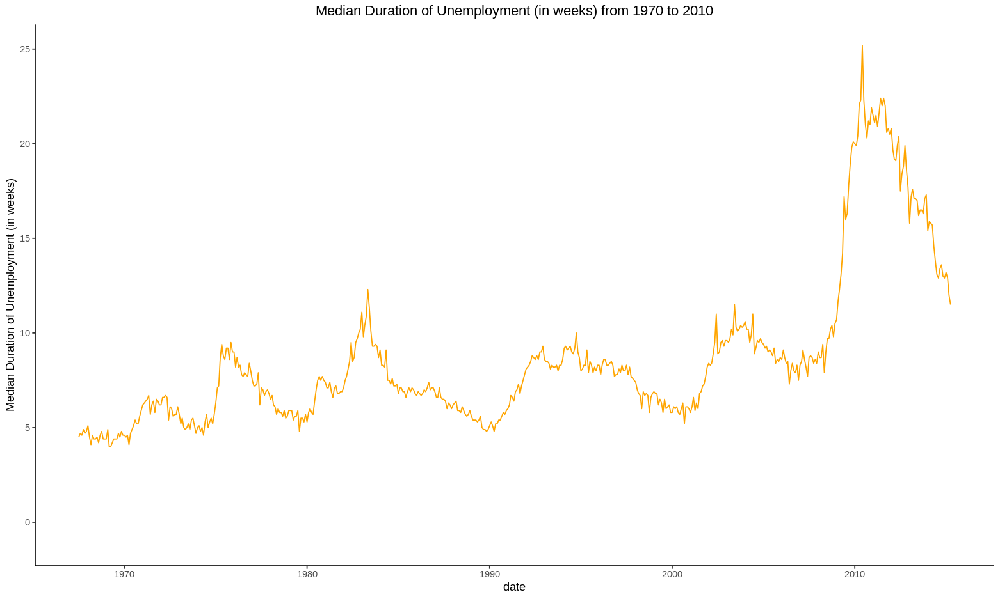
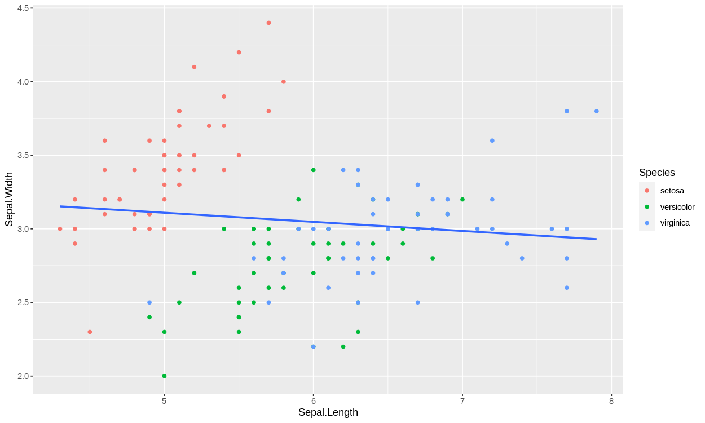
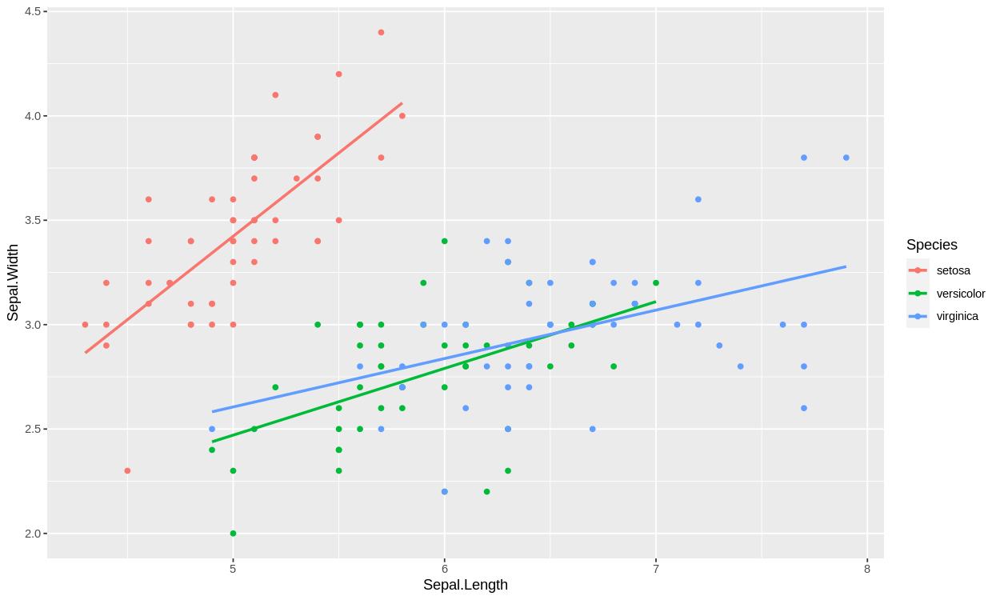
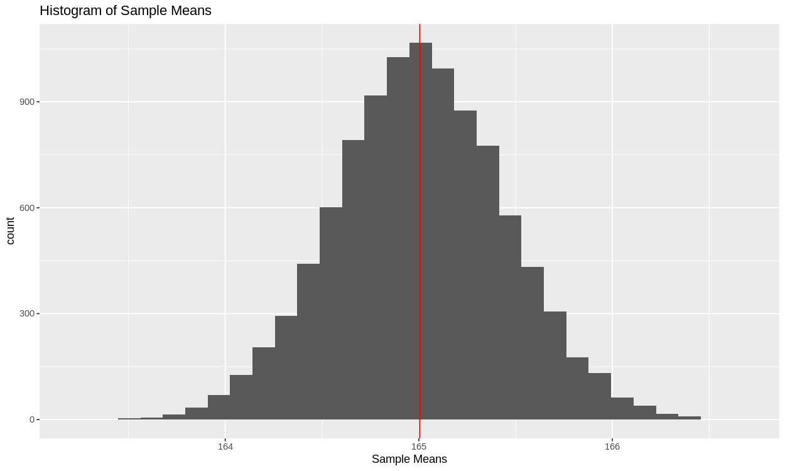
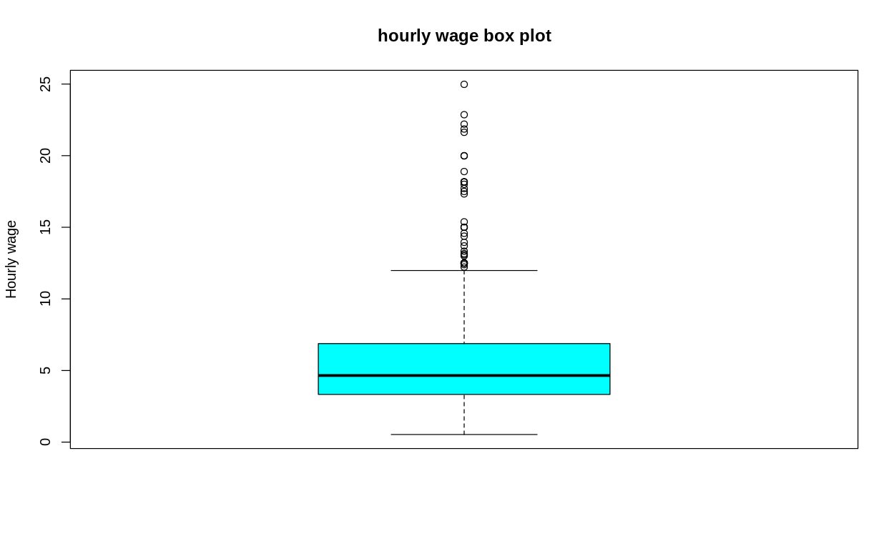
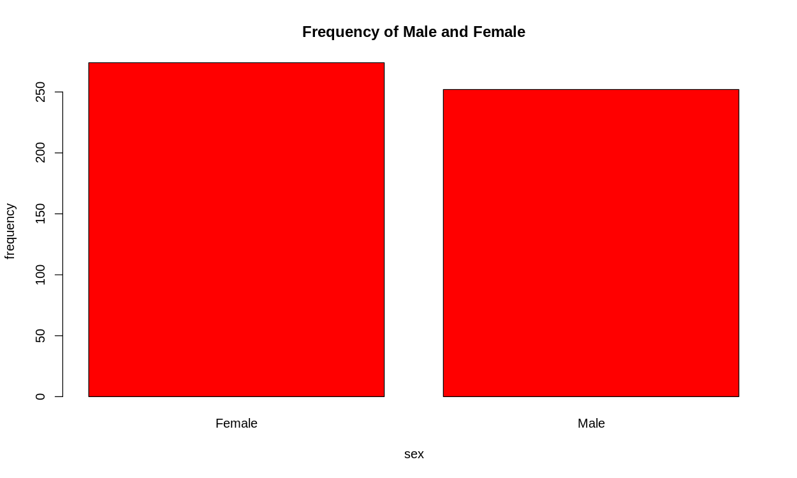
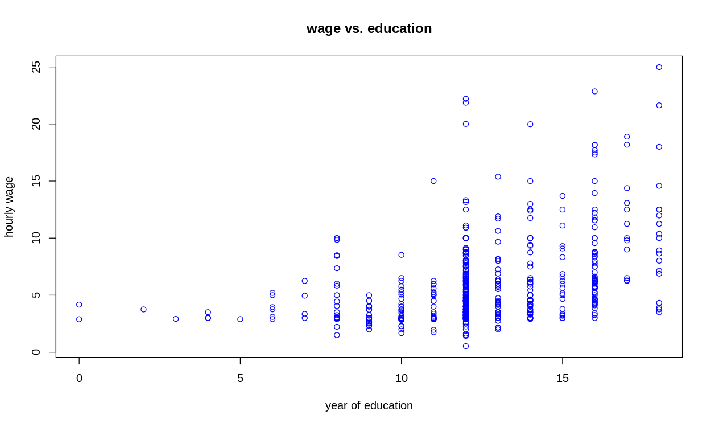

# Question 1

## 1.a

```R
library(tidyverse)

ggplot(data = economics, mapping = aes(x = date, y = uempmed)) +
  geom_line(color = "orange") +  # Set line color to orange
  labs(
    x = "date",
    y = "Median Duration of Unemployment (in weeks)",  # Add y-axis label
    title = "Median Duration of Unemployment (in weeks) from 1970 to 2010"  # Add plot title
  ) +
  theme_classic() + # Use classic theme
  theme(plot.title = element_text(hjust = 0.5)) +  # Center the title
  coord_cartesian(ylim = c(-1, 25))  # reset y-axis
```

Except the slight difference in width and height of the graph, which is controlled by environment (and not explicitly specified), the plot should be exactly the same as given.



## 1.b

```R
library(tidyverse)

ggplot(iris) + 
  geom_point(mapping = aes(x = Sepal.Length, y = Sepal.Width, col = Species)) + 
  geom_smooth(method = "lm", mapping = aes(x = Sepal.Length, y = Sepal.Width), se=FALSE)
```

This should gives the plotting required



To fit the data separately, we should pass col to the `mapping` in `geom_smooth` too, in which case, a global mapping should suffice.

```R
library(tidyverse)

ggplot(iris, mapping = aes(x = Sepal.Length, y = Sepal.Width, col = Species)) + 
  geom_point() + 
  geom_smooth(method = "lm", se=FALSE)
```



# Question 2

## 2.a

```R
sum <- 0

for (i in seq(1, 99, by = 2)) {
  sum <- sum + i
}

print(sum)
```

The result is `2500`

## 2.b

```R
sum <- 0

for (i in seq(1, 100)) {
  sum <- sum + (i + 2 * i ** 2 + sqrt(i ** 3))
}

print(sum)
```

The result is `722251.2`

## 2.c

```R
set.seed(42)
sample <- rnorm(n = 2000, mean = 165, sd = 20)
x.bar <- mean(sample)
```

And we have 

```R
> x.bar
[1] 164.6886
```

## 2.d

Continue from codes above,

```R
sd <- sqrt(var(sample))
se <- sd / sqrt(2000 - 1)
ci <- c(x.bar - se * 1.96, x.bar + se * 1.96)
```

The 95% confidence interval is estimated to be 

```R
> ci
[1] 163.8170 165.5602
```

And the true value `165` is in it. This is no surprise since we do sampling from the normal distribution $N(165, 20)$ and 95% is a pretty large range.

## 2.e

```R
set.seed(42)

sample_means <- c()
n <- 10000

for (i in 1:n) {
  x.bar <- mean(rnorm(n = 2000, mean = 165, sd = 20))
  sample_means[[i]] <- x.bar
}

sample_means <- as.numeric(sample_means)

ggplot(data.frame(sample_means = sample_means), aes(x = sample_means)) +
    geom_histogram() +
    geom_vline(xintercept = mean(sample_means), color = "red") +
    labs(
        title = "Histogram of Sample Means",
        x = "Sample Means"
    )
```

The red vertical line is the mean of the sample_means, which is 

```R
> paste("Average of sample means = ", mean(sample_means))
[1] "Average of sample means =  165.004712566088"
```



The average of sample means is fairly close to the true value, which is not surprising as a result of law of the large number.

## 2.f

```R
set.seed(42)

sample_means <- c()
n <- 10000
is_in <- 0

for (i in 1:n) {
  sample <- rnorm(n = 2000, mean = 165, sd = 20)
  x.bar <- mean(sample)
  sd <- sqrt(var(sample))
  se <- sd / sqrt(2000 - 1)
  ci <- c(x.bar - se * 1.96, x.bar + se * 1.96)
  if (ci[1] < 165 & 165 < ci[2]) {is_in <- is_in + 1}
}
```

The result is 

```R
> print(is_in)
[1] 9508
```

The answer makes perfect sense. In 95.08% of the cases, the true value falls within the confidence interval. This is consistent with the definition of a 95% confidence interval.

# Question 4

## 4.a

```R
> library(haven)
> WAGE1 <- read_dta("Downloads/WAGE1.DTA")
> View(WAGE1)
> mydata <- WAGE1
```

## 4.b

```R
> head(mydata, 10)
# A tibble: 10 × 24
    wage  educ exper tenure nonwhite female married numdep  smsa northcen south  west
   <dbl> <dbl> <dbl>  <dbl>    <dbl>  <dbl>   <dbl>  <dbl> <dbl>    <dbl> <dbl> <dbl>
 1  3.10    11     2      0        0      1       0      2     1        0     0     1
 2  3.24    12    22      2        0      1       1      3     1        0     0     1
 3  3       11     2      0        0      0       0      2     0        0     0     1
 4  6        8    44     28        0      0       1      0     1        0     0     1
 5  5.30    12     7      2        0      0       1      1     0        0     0     1
 6  8.75    16     9      8        0      0       1      0     1        0     0     1
 7 11.2     18    15      7        0      0       0      0     1        0     0     1
 8  5       12     5      3        0      1       0      0     1        0     0     1
 9  3.60    12    26      4        0      1       0      2     1        0     0     1
10 18.2     17    22     21        0      0       1      0     1        0     0     1
# ℹ 12 more variables: construc <dbl>, ndurman <dbl>, trcommpu <dbl>, trade <dbl>,
#   services <dbl>, profserv <dbl>, profocc <dbl>, clerocc <dbl>, servocc <dbl>,
#   lwage <dbl>, expersq <dbl>, tenursq <dbl>
```

## 4.c

```R
> summarize(mydata, mean(wage), max(wage), min(wage), median(wage))
# A tibble: 1 × 4
  `mean(wage)` `max(wage)` `min(wage)` `median(wage)`
         <dbl>       <dbl>       <dbl>          <dbl>
1         5.90        25.0       0.530           4.65
```

## 4.d

```R
boxplot(mydata$wage, col = "cyan", ylab = "Hourly wage", main = "hourly wage box plot")
```



This box plot shows
- the distribution is skewed, to the right / top
- the sample is having some large outliers
- median is lower than the mean of the distribution

## 4.e

continued from above

```R
barplot(table(mydata$female),
        names.arg = c("Female", "Male"), 
        xlab = "sex", ylab = "frequency",
        main = "Frequency of Male and Female", 
        col="red")
```




## 4.f

```R
plot(x = mydata$educ, 
     y = mydata$wage,
     col = "blue",
     xlab = "year of education",
     ylab = "hourly wage",
     main = "wage vs. education")
```



# Question 5

Supervised learning is a machine learning algorithm that provides input data x and labels/goals y to a model and finds out how they are related. Common algorithms include regression and classification. Tasks such as handwriting recognition (the training set needs to be provided with a picture / grayscale matrix, and the corresponding character), translation (original language x and target language y).

Unsupervised learning is an algorithm that only provides x to the model and has the model perform its own learning tasks. This includes clustering, dimensionality reduction, etc. Such as PCA (only the input data x is provided).
