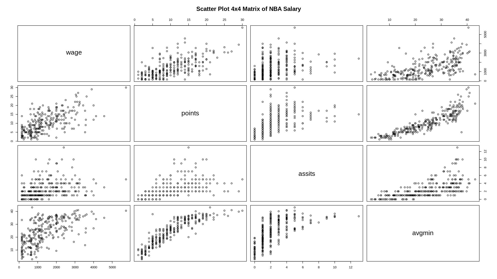
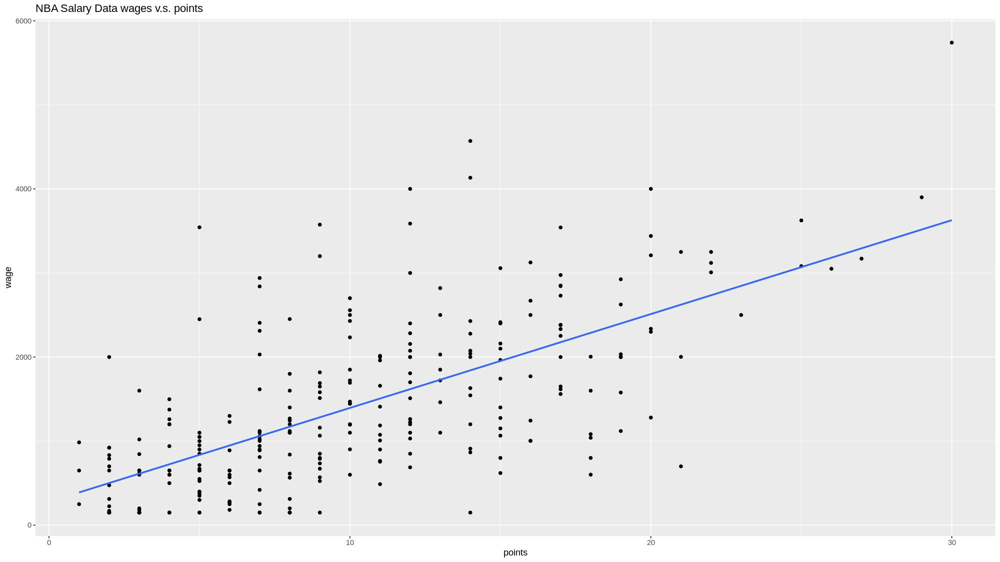
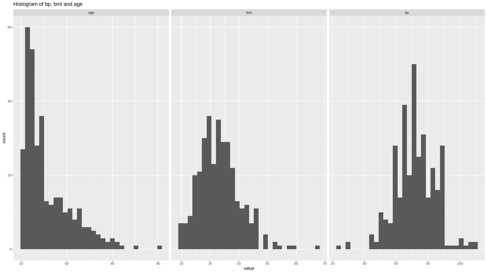
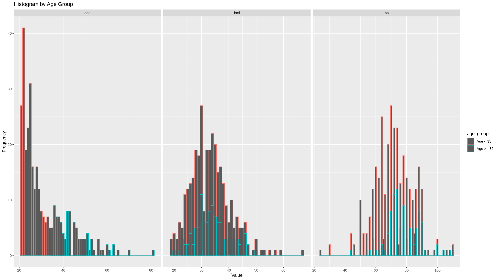
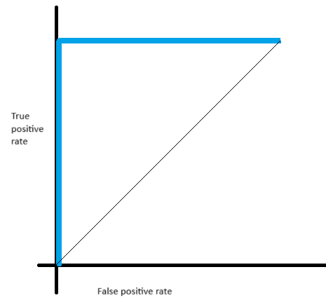

# Question 1

## 1.a

Since the mean of squared error *MSE* equals the square of the *Bias* plus *Variance*

$$
\begin{align*}
MSE = E\left[\left(f(X) - \hat{f}(X)\right)^2\right] & = E\left[f(X) - \hat{f}(X)\right]^2 + Var(\hat{f}(X)) \\
& = Bias^2 + Variance
\end{align*}
$$

Without farther improvement of the fitness of the model $\hat{f}$, which means the $MSE$ stay constant.
- a reduce in $Bias^2$ must lead to an increase in $Variance$
- a reduce in $Variance$ must lead to an increase in $Bias^2$
- which means the *Bias* plus *Variance* must be a trade-off

## 1.b

divide the data into training set and test set

1. a model with over-fitting problem will
- the model perform will in the training set and perform badly in the test set
- with the training process goes on, e.g. say with more training epochs or more parameters, 
- the metrics in the training set keeps getting better 
- while the metrics in the test set keeps getting worse
- suggesting parameters are specialized into fitting of the training set at the cost of generalization abilities.

2. a model with under-fitting problem however, will
- with the training process goes on
- metrics in the training set and test set keeps improving
- indicating that the original model still need more fitting / training.

# Question 2

## 2.a

$$
\begin{align*}
Prob(Y = 1 | X) &= E(Y | X) \\
&= E(\beta_0 + \beta_1 x_1 + \cdots + \beta_k x_k + \epsilon | X) \\
&= E(\beta_0 + \beta_1 x_1 + \cdots + \beta_k x_k | X) + E(\epsilon | X) \\
& = \beta_0 + \beta_1 x_1 + \cdots + \beta_k x_k
\end{align*}
$$

## 2.b

$$
\begin{align*}
\hat{y} &= E(-0.3 + 0.3 x_1 - 0.15 x_2 + 0.05 x_3 | x_1 = 3, x_2 = 4, x_3 = 6) \\
& = 0.3
\end{align*}
$$

the $\hat{y} = 0.3$ means that there is 30% probability that $y = 1$ and 70% probability that $y = 0$

## 2.c

The $\hat{\beta_1}$ is the partial effect of the explanatory variable $x_1$, on the predicted probability.
- say in the 2.b, the $\beta_1 = 0.3$
- means that every additional unit increased in $x_1$ will cause predicted probability of $Y = 1$ increase by 0.3

## 2.d

linear probability model v.s. logistic model
- logistic model has a prediction interval of $[0, 1]$, while linear model have no constrain on prediction range.
- logistic model has NO closed-form solution, while linear model does.

# Question 3

## 3.a

*LDA* assumptions:
- all features $X_i$ follows normal distribution (multi-variate Gaussian distribution)
- all features $X_i$ having same standard deviations

## 3.b

*LDA* v.s. *QDA*

- *LDA* assume same variance, in other words, covariance matrix with same common value.
- *QDA* does not assume that, allowing each class to have its own variance-covariance matrix.

# Question 4

## 4.a

```R
> library(readxl)
> NBAsalary <- read_excel("Downloads/NBAsalary.xls")
> pairs(NBAsalary[c('wage', 'points', 'assits', 'avgmin')], main = "Scatter Plot 4x4 Matrix of NBA Salary")
```

the plot is shown as followed



from the plot we can see
- *wage* is strongly positively correlated with *points* and *avgmin*
    - this is straight forward that the wage should be determined by the value a player can provide to the game
    - that is how much points he can gain per game
    - and how long he can play per game
    - the assists per game shows positive signs but not that clear.
    - which may comes from the fact that assists per game is strongly correlated with the time played per game
- the *points* is positively correlated with *assits* and *avgmin*, with good linear relationship
    - it is natural to assume that the longer a play in the field, the more points he earns per game.
    - the more he controls the ball, or the better his ability is, that the more assists he will provide and the more point he will earns.
- *assits* also seems having positive linear correlation with *avgmin*
    - this is natural that the longer he plays per game, the more likely that he provides assists

## 4.b

```R
> fit <- lm(wage ~ points, data = NBAsalary)
```

the result is shown as followed:

```R
> summary(fit)
Call:
lm(formula = wage ~ points, data = NBAsalary)

Residuals:
     Min       1Q   Median       3Q      Max 
-1923.10  -463.10   -96.44   385.23  2728.56 

Coefficients:
            Estimate Std. Error t value Pr(>|t|)    
(Intercept)  278.102     92.694    3.00  0.00295 ** 
points       111.667      7.841   14.24  < 2e-16 ***
---
Signif. codes:  0 ‘***’ 0.001 ‘**’ 0.01 ‘*’ 0.05 ‘.’ 0.1 ‘ ’ 1

Residual standard error: 755.1 on 267 degrees of freedom
Multiple R-squared:  0.4317,	Adjusted R-squared:  0.4296 
F-statistic: 202.8 on 1 and 267 DF,  p-value: < 2.2e-16
```

the regression has a R-squared of $0.4317$, 
- the coefficient is significant
- but R-squared is not very high
- means we might left some informational data used.

## 4.c

```R
> confint(fit)
               2.5 %   97.5 %
(Intercept) 95.59809 460.6065
points      96.22833 127.1051
```

the 95% confidence interval of $\beta_1$ are $[96.22833, 127.1051]$
- which means that we are 95% confident that
- the true value of $\beta_1$ for a model $wage = \beta_0 + \beta_1 points + \epsilon$
- lies between $[96.22833, 127.1051]$
- the confidence interval is quite large, means the variance of the fit is large, this might not be a good fit

## 4.d

```R
> ggplot(NBAsalary) + 
+     geom_point(mapping = aes(x = points, y = wage)) + 
+     geom_smooth(method = "lm", mapping = aes(x = points, y = wage), se=FALSE) + 
+     ggtitle("NBA Salary Data wages v.s. points")
```

The plot is shown as followed



## 4.e

```R
> fit.all <- lm(wage ~ points + avgmin + forward + center + exper + black, data = NBAsalary)
```

the results are

```R
> summary(fit.all)

Call:
lm(formula = wage ~ points + avgmin + forward + center + exper + 
    black, data = NBAsalary)

Residuals:
     Min       1Q   Median       3Q      Max 
-1664.61  -382.68   -56.48   354.36  2830.20 

Coefficients:
            Estimate Std. Error t value Pr(>|t|)    
(Intercept) -503.354    156.014  -3.226  0.00141 ** 
points        83.115     15.119   5.498 9.14e-08 ***
avgmin        16.695      9.306   1.794  0.07396 .  
forward      259.732     89.941   2.888  0.00420 ** 
center       606.627    121.699   4.985 1.13e-06 ***
exper         77.654     12.437   6.244 1.71e-09 ***
black         82.569    106.185   0.778  0.43751    
---
Signif. codes:  0 ‘***’ 0.001 ‘**’ 0.01 ‘*’ 0.05 ‘.’ 0.1 ‘ ’ 1

Residual standard error: 669.5 on 262 degrees of freedom
Multiple R-squared:  0.5616,	Adjusted R-squared:  0.5515 
F-statistic: 55.93 on 6 and 262 DF,  p-value: < 2.2e-16
```

## 4.f

```R
> library(MASS)
> stepAIC(fit.all, direction = "both")
```

the results are

```R
Start:  AIC=3507.43
wage ~ points + avgmin + forward + center + exper + black

          Df Sum of Sq       RSS    AIC
- black    1    271037 117712809 3506.1
<none>                 117441772 3507.4
- avgmin   1   1442751 118884523 3508.7
- forward  1   3738139 121179910 3513.9
- center   1  11137562 128579334 3529.8
- points   1  13547301 130989072 3534.8
- exper    1  17475480 134917252 3542.7

Step:  AIC=3506.05
wage ~ points + avgmin + forward + center + exper

          Df Sum of Sq       RSS    AIC
<none>                 117712809 3506.1
+ black    1    271037 117441772 3507.4
- avgmin   1   1503284 119216093 3507.5
- forward  1   3805357 121518165 3512.6
- center   1  10866537 128579346 3527.8
- points   1  13565974 131278783 3533.4
- exper    1  17406020 135118828 3541.2

Call:
lm(formula = wage ~ points + avgmin + forward + center + exper, 
    data = NBAsalary)

Coefficients:
(Intercept)       points       avgmin      forward       center        exper  
    -442.75        83.17        17.02       261.93       591.96        77.49
```

in the `stepAIC` process, 
- the function test each scenario with one variable excluded from the regression 
- the model without variable $black$ has the lowest AIC
- thus the stepAIC select this model
- variable $black$ gives little information to the model and risk over-fitting.

## 4.g

```R
> obs <- NBAsalary[1, ]
> pred <- pred <- predict(fit.all, obs, interval = "confidence", level = 0.90)
```

the results are

```R
> pred
       fit      lwr      upr
1 1841.238 1694.743 1987.732
```

the prediction of first observation is $1841.238$, with **90%** confidence interval $[1694.743, 1987.732]$

## 4.h

```R
> accuracy(fit.all)
                       ME     RMSE      MAE      MPE     MAPE      MASE
Training set 2.956743e-15 660.7469 499.7108 -44.4165 73.01184 0.6183668
```

The *RMSE* of the training set is $660.7469$
- this is quite large, considering the mean of the wage is $1423.828$
- the sample std is $999.7741$
- which means that the model only explain a small part of the data variation
- one of the result that the *RMSE* is too high is that model might be under-fitting, a linear regression model may not be sufficient to explain the pricing / salary of the NBA player

## 4.i

Not necessary
- measuring goodness of fit and goodness of prediction are two different things
- a model with multi-colinearity issue, might be a bad fit, but this issue is not likely to affect prediction accuracy.
- a model with over-fitting issue, might be a good fit (on the training set), but is likely to produce bad prediction.

# Question 5

## 5.a

```R
> library(MASS)
> View(Pima.te)
> class(Pima.te)
[1] "data.frame"
```

the summary is shown as followed

```R
> summary(Pima.te)
> summary(Pima.te)
     npreg             glu              bp              skin            bmi             ped              age         type    
 Min.   : 0.000   Min.   : 65.0   Min.   : 24.00   Min.   : 7.00   Min.   :19.40   Min.   :0.0850   Min.   :21.00   No :223  
 1st Qu.: 1.000   1st Qu.: 96.0   1st Qu.: 64.00   1st Qu.:22.00   1st Qu.:28.18   1st Qu.:0.2660   1st Qu.:23.00   Yes:109  
 Median : 2.000   Median :112.0   Median : 72.00   Median :29.00   Median :32.90   Median :0.4400   Median :27.00            
 Mean   : 3.485   Mean   :119.3   Mean   : 71.65   Mean   :29.16   Mean   :33.24   Mean   :0.5284   Mean   :31.32            
 3rd Qu.: 5.000   3rd Qu.:136.2   3rd Qu.: 80.00   3rd Qu.:36.00   3rd Qu.:37.20   3rd Qu.:0.6793   3rd Qu.:37.00            
 Max.   :17.000   Max.   :197.0   Max.   :110.00   Max.   :63.00   Max.   :67.10   Max.   :2.4200   Max.   :81.00            
```

## 5.b

```R
> library(dplry)
> result <- Pima.te %>%
+     group_by(age_group = ifelse(age >= 35, "age >= 35", "age < 35")) %>%
+     summarise(
+         mean_bp = mean(bp),
+         mean_bmi = mean(bmi),
+         mean_age = mean(age)
+     )
```

the results are

```R
> print(result)
# A tibble: 2 × 4
  age_group mean_bp mean_bmi mean_age
  <chr>       <dbl>    <dbl>    <dbl>
1 age < 35     68.9     33.0     25.3
2 age >= 35    77.9     33.8     44.9
```

Intuition
- since we do the summary grouped by age, of course `age < 35` having lower average $age$
- younger people tend to work out more, which might explain the lower $bp$ and $bmi$
- this is the data from India, as the country developes (better food, health care and feminine rights), the younger people are growing taller and taller, which may also explain the lower $bmi$

## 5.c

the histograms are

```R
> ggplot(gather(Pima.te[c('bp', 'bmi', 'age')]), aes(value)) + 
+     geom_histogram() + 
+     ggtitle('Histogram of bp, bmi and age')+
+     facet_wrap(~key, scales = 'free_x')
```



the box plots are

```R
> ggplot(gather(Pima.te[c('bp', 'bmi', 'age')]), aes(value)) + 
+     geom_boxplot() + 
+     ggtitle('Box plot of bp, bmi and age')+
+     facet_wrap(~key, scales = 'free_x')
```


obviously only $age$ is normally distributed

## 5.d

```R
> df <- mutate(Pima.te[c('bp', 'bmi', 'age')], age_group = ifelse(age >= 35, "Age >= 35", "Age < 35"))
> gathered_df <- gather(df, key = "variable", value = "value", -age_group)
> ggplot(gathered_df, aes(x = value, col = age_group)) +
+     geom_histogram(binwidth = 1) +
+     facet_wrap(~variable, scales = "free_x") +
+     labs(x = "Value", y = "Frequency") +
+     ggtitle("Histogram by Age Group")
```



## 5.e

randomly split training and test sets

```R
set.seed(42)
n_test <- round(0.15 * nrow(Pima.te))
test_indices <- sample(seq_len(nrow(Pima.te)), size = n_test)

data.test <- Pima.te[test_indices, ]
data.training <- Pima.te[-test_indices, ]
```

fit the LDA

```R
fit.lda <- lda(type ~ ., data = data.training)
```

predict on the test set

```R
mydata.lda <- predict(fit.lda, newdata = data.test)
```

## 5.f

`data.test$type` is the actual value (of diabetes diagnosis)

## 5.g

`mydata.lda$class` is the predicted value (of diabetes diagnosis)

## 5.h

```R
> table(data.test$type, mydata.lda$class)
     
      No Yes
  No  30   1
  Yes 11   8
> mean(data.test$type == mydata.lda$class)
[1] 0.76
```

the accuracy is 76%

```R
predicted_probs <- mydata.lda$posterior[, "Yes"]

library(pROC)
roc.lda <- roc(data.test$type, predicted_probs)
```

the result is 

```R
> roc.lda

Call:
roc.default(response = data.test$type, predictor = predicted_probs)

Data: predicted_probs in 31 controls (data.test$type No) < 19 cases (data.test$type Yes).
Area under the curve: 0.8523
```

AUC is 0.8523

## 5.i

```R
fit.qda <- qda(type ~ ., data = data.training)
pred.qda <- predict(fit.qda, newdata = data.test)
predicted_probs <- pred.qda$posterior[, "Yes"]
roc.qda <- roc(data.test$type, predicted_probs)
```

result is 

```R
> roc.qda

Call:
roc.default(response = data.test$type, predictor = predicted_probs)

Data: predicted_probs in 31 controls (data.test$type No) < 19 cases (data.test$type Yes).
Area under the curve: 0.854
```

AUC is 0.854

## 5.j

*QDA* is better
- *QDA* provide better result on validation set
- obviously the age and bp, bmi having different distribution (variance and covariance), which not meet the assumption of *LDA*
- the data set is large enough to support *QDA*

# Question 6

## 6.a

$$
\begin{align*}
\text{accuracy rate} &= \dfrac{5500 + 650}{5500 + 350 + 400 + 650} &= 89.13\% \\ 
\text{precision rate} &= \dfrac{650}{400 + 650} &= 61.90\% \\ 
\end{align*}
$$

This difference is coming from the difference of *Sensitivity* and *Specificity*, in other words the difference of rate of making type-I error and type-II error.

## 6.b

$$
\begin{align*}
\text{Sensitivity} &= \dfrac{650}{350 + 650} &= 65.00\% \\ 
\text{Specificity} &= \dfrac{5500}{400 + 5500} &= 93.22\% \\ 
\end{align*}
$$

## 6.c

NOT good, because the Sensitivity is very low, letting many True cases miss-tested.

## 6.d

$$
1 - \text{Specificity} = 6.78\%
$$

## 6.e



AUC equals 1 will have true positive rate = 100%, false positive rate = 0%. This is NOT realistic.

## 6.f

With AUC equals 0.5, the model is basically gives random prediction. There is no classification capability, and basically no information.

with AUC smaller than 0.5, the model is giving opposite result (do worst than the random prediction). And is a bad model by nature.

## 6.h

For a test designed to test Covid-19
- we want those people who are positive, to be tested as positive as likely as possible. which is high Sensitivity
- and we want those people who are negative, to be NOT tested as positive as likely as possible, which is false negative (1 - Specificity) rate as low as possible

## 6.i

training set: the data we use to train the model

validation set: the data we use to calculate metrics of the model, and to select the best model / parameters.

test set: the data we use to calculate the result of the selected model.

5-fold cross-validation
- divide the data randomly into 5 parts
- select 1 part as validation set, and the rest as training set, train the model and calculate metrics (say MSE)
- repeat the operate above 4 more times, each time selecting different part as validation set.
- average the validation metric (MSE) of each iteration
- select the best model based on the average metrics above. This gives, on average, how will the model will perform on unseen data.
- finally, use the whole sample to train the selected model.