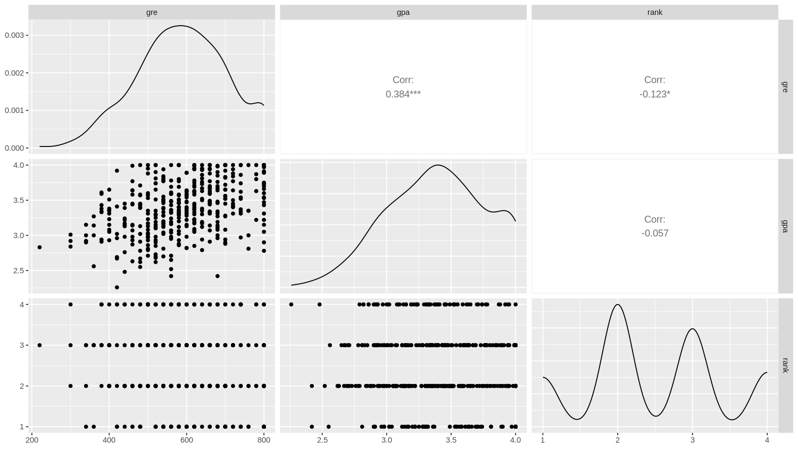
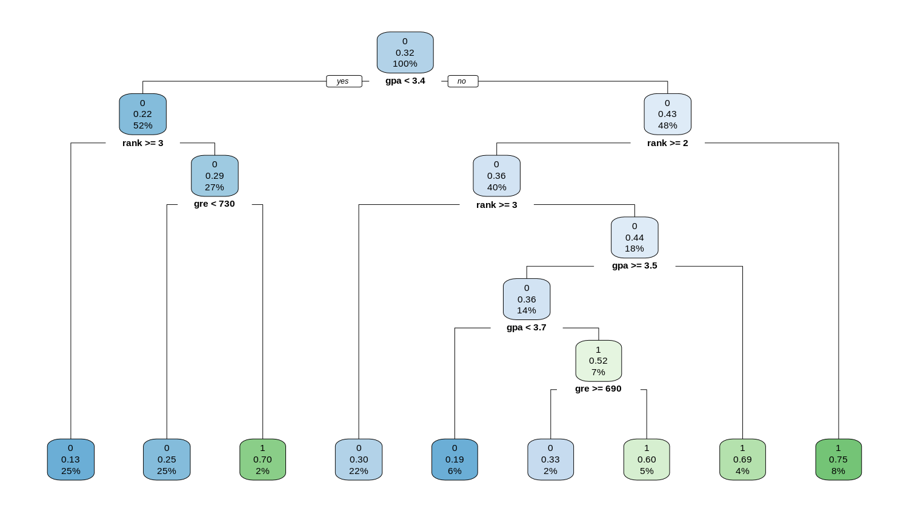
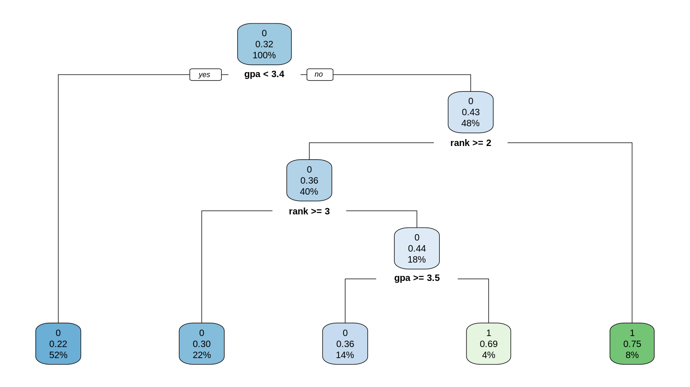

[TOC]

# Question 1

## 1.a

```R
library(readxl)
admission <- read_excel("Downloads/admission.xlsx")
library(GGally)
library(ggplot2)
ggpairs(admission, columns = c("gre", "gpa", "rank"))
```



Features relationships
- the *GPA* and *GRE* are significantly positive correlated. 
    - This is natural, since both feature is a metrics of applicant's ability.
- The *rank* shows some positive correlation with *GRE*. 
    - Since applicants with better ability usually end up in better schools, this is also reasonable.
- The *rank* shows no correlation with *GPA*. 
    - The applicants' *GPA* is graded by individual institutions, and lack the ability to make horizontal (cross-institution) comparisons.

## 1.b

```R
library(dplyr)
summarise(group_by(admission, rank), mean(gpa))
```

The results are shown as followed:

```R
# A tibble: 4 × 2
   rank `mean(gpa)`
  <dbl>       <dbl>
1     1        3.45
2     2        3.36
3     3        3.43
4     4        3.32
```

## 1.c

The percentage of applications accepted is the mean of *admit*

```R
summarise(group_by(admission, rank), "percentage of admitted in %" = mean(admit) * 100)
```

The results are:

```R
   rank `percentage of admitted in %`
  <dbl>                         <dbl>
1     1                          54.1
2     2                          35.8
3     3                          23.1
4     4                          17.9
```

## 1.d

Now we build the tree, without considering over-fitting issue, using `rpart`

```R
library(rpart)
library(rpart.plot)
set.seed(42)
# admission$admit <- as.factor(admission$admit)
tree <- rpart(formula = admit ~ gpa + gre + rank, data = admission, method = "class")
rpart.plot(tree)
```


Decision tree with 8 branches (splits) and 4 layers of structure.
- Forked based on `GPA <= 3.4`.
- Low *GPA* group is forked based on `rank >= 3`.
    - High *rank* group then forked based on `gre < 730`.
- High gpa group do multiple forking based on `rank >= 2` and `rank >= 3`.
    - then `3 >= rank >= 2` do multiple forking based on `gpa >= 3.5` and `gpa < 3.7`.
- AT each leaf node, calculate the probability of *admit*, and make classification based on this.


## 1.e

```R
> printcp(tree)

Classification tree:
rpart(formula = admit ~ gpa + gre + rank, data = admission, method = "class")

Variables actually used in tree construction:
[1] gpa  gre  rank

Root node error: 127/400 = 0.3175

n= 400 

        CP nsplit rel error  xerror     xstd
1 0.062992      0   1.00000 1.00000 0.073308
2 0.023622      2   0.87402 0.95276 0.072337
3 0.015748      4   0.82677 0.96063 0.072505
4 0.010000      8   0.76378 1.00000 0.073308
```

The results above shows that:
- at initial value `cp = 0.01`, the tree having 8 splits and with a cross-validation error `1.0 * 0.3175`
- at `cp = 0.015748`, the tree reduced to 4 splits and with a cross-validation error `0.96063 * 0.3175`
- at `cp = 0.023622`, the tree reduced to 2 splits and with a cross-validation error `0.95276 * 0.3175`
- at `cp = 0.062992`, the tree has no split, which gives little info other than the average.

The best scenario is `cp = 0.023622`, which gives the least cross-validation error. Rebuild the tree with the given parameters gives us

```R
tree.pruned <- prune(tree, cp = 0.023622)
```

The new tree is 

```R
rpart.plot(tree.pruned)
```



Note, that after complexity regularization, the tree left with only 2 split and 5 leaf nodes.

## 1.f

```R
> predict(tree.pruned, list(gpa = 3.2, gre = 530, rank = 2))
          0         1
1 0.7836538 0.2163462
```

Thus, the applicant should be rejected.

# Question 2

1. Step 1. Standardize the Training Set

with min-max standardization

| Age   | Inc   | Educ  |
|-------|-------|-------|
| 0.806 | 1.000 | 1.000 |
| 0.611 | 0.336 | 0.375 |
| 0.000 | 0.000 | 0.000 |
| 0.389 | 0.404 | 0.125 |
| 1.000 | 0.301 | 0.375 |
| 0.056 | 0.233 | 0.875 |

2. Step 2. Calculate the Distance

We use Euclidean distance.

| Idx | Age   | Inc   | Educ  | Default | Dis   |
|-----|-------|-------|-------|---------|-------|
| 1   | 0.806 | 1.000 | 1.000 | 0       | 0.494 |
| 2   | 0.611 | 0.336 | 0.375 | 0       | 0.073 |
| 3   | 0.000 | 0.000 | 0.000 | 1       | 0.956 |
| 4   | 0.389 | 0.404 | 0.125 | 1       | 0.301 |
| 5   | 1.000 | 0.301 | 0.375 | 0       | 0.232 |
| 6   | 0.056 | 0.233 | 0.875 | 1       | 0.413 |

3. Step 3. Find Nearest Neighbor

The 3-nearest neighbors are #2, #5 and #4, the majority is non-default.

Thus our conclusion is that he/she will **NOT** default.

# Question 3

1. for $X1 (\text{Gender})$

$$
\begin{align*}
G(\text{Gender}, \text{Male}) &= 1 - \left(\frac{2}{4}\right)^2 - \left(\frac{2}{4}\right)^2 &&= \frac{1}{2} \\
G(\text{Gender}, \text{Female}) &= 1 - \left(\frac{2}{4}\right)^2 - \left(\frac{2}{4}\right)^2 &&= \frac{1}{2} \\
G(\text{Gender}) &= \frac{4}{8} \times G(\text{Gender}, \text{Male}) + \frac{4}{8} \times G(\text{Gender}, \text{Female}) &&= \frac{1}{2} = 0.5
\end{align*}
$$

2. for $X2 (\text{Education})$

$$
\begin{align*}
G(\text{Education}, \text{No formal education}) &= 1 - \left(\frac{0}{2}\right)^2 - \left(\frac{2}{2}\right)^2 &&= 0 \\
G(\text{Education}, \text{Degree}) &= 1 - \left(\frac{3}{4}\right)^2 - \left(\frac{1}{4}\right)^2 &&= \frac{3}{8} \\
G(\text{Education}, \text{Secondary}) &= 1 - \left(\frac{1}{2}\right)^2 - \left(\frac{1}{2}\right)^2 &&= \frac{1}{2} \\
G(\text{Gender}) &= \frac{2}{8} \times 0 + \frac{4}{8} \times \frac{3}{8} + \frac{2}{8} \times \frac{1}{2} &&= \frac{5}{16} = 0.3125
\end{align*}
$$

3. for $X3 (\text{Place})$

$$
\begin{align*}
G(\text{Place}, \text{Suburban}) &= 1 - \left(\frac{2}{3}\right)^2 - \left(\frac{1}{3}\right)^2 &&= \frac{4}{9} \\
G(\text{Place}, \text{Urban}) &= 1 - \left(\frac{2}{5}\right)^2 - \left(\frac{3}{5}\right)^2 &&= \frac{12}{25} \\
G(\text{Place}) &= \frac{3}{8} \times \frac{4}{9} + \frac{5}{8} \times \frac{12}{25} &&= \frac{7}{15} = 0.4667
\end{align*}
$$

The $X2 (\text{Education})$ having the lowest Gini index, thus should be used as the first internal node.

the node we propose is that 
- Degree -> Single
- Otherwise -> Married

This misclassification rate is 25%

# Question 4

## 4.a

### 4.a.0 - Data Summary

Before we do any modeling, we should conduct some descriptive statistics to determine the baseline.

```R
> library(skimr)
> statistics <- skim(Stock_2018)
```

We print the result in html, and extract the tables, some columns are removed for better readability.

```R
knit_print(statistics)
```

The results are shown as followed

**Data summary**

| Name                     | Stock_2018 |
|--------------------------|------------|
| Number of rows           | 4392       |
| Number of columns        | 15         |
| _______________________  |
| Column type frequency:   |
| character                | 1          |
| numeric                  | 14         |
| ________________________ |
| Group variables          | None       |


**Variable type: character**

| skim_variable | n_missing | complete_rate | min | max | empty | n_unique | whitespace |
|---------------|-----------|---------------|-----|-----|-------|----------|------------|
| Company Name  | 0         | 1             | 1   | 5   | 0     | 4392     | 0          |


**Variable type: numeric**

| skim_variable               | n_missing | mean     | sd         | p0          | p25   | p50   | p75   | p100          |
|-----------------------------|----------:|---------:|-----------:|------------:|------:|------:|------:|--------------:|
| Revenue Growth              | 139       | 3.46     | 195.50     | -3.46       | 0.00  | 0.07  | 0.19  | 12,739.00     |
| EPS                         | 65        | -69.94   | 5,718.69   | -359,825.00 | -0.39 | 0.69  | 2.31  | 101,641.00    |
| Profit Margin               | 306       | -8.26    | 185.02     | -8,964.92   | -0.05 | 0.04  | 0.14  | 3,090.87      |
| Net Profit Margin           | 176       | -4.82    | 103.48     | -5,009.17   | -0.03 | 0.05  | 0.15  | 1,056.47      |
| dividendYield               | 259       | 0.26     | 6.74       | 0.00        | 0.00  | 0.00  | 0.03  | 373.13        |
| returnOnAssets              | 1,106     | 0.00     | 6.69       | -193.68     | -0.17 | 0.04  | 0.18  | 203.46        |
| returnOnEquity              | 256       | 2,685.09 | 173,237.49 | -34,772.46  | -0.08 | 0.07  | 0.15  | 11,141,141.67 |
| debtRatio                   | 251       | 0.27     | 0.49       | -0.42       | 0.04  | 0.21  | 0.40  | 24.36         |
| PE ratio                    | 252       | 24.04    | 105.52     | 0.00        | 0.00  | 10.76 | 20.46 | 3,842.00      |
| Dividend Yield              | 251       | 0.02     | 0.11       | 0.00        | 0.00  | 0.00  | 0.02  | 5.97          |
| Book Value per Share Growth | 271       | 0.26     | 5.61       | -32.26      | -0.11 | 0.03  | 0.14  | 313.40        |
| Debt Growth                 | 264       | 9.93     | 363.72     | -1.00       | -0.08 | 0.00  | 0.12  | 17,646.82     |
| R&D Expense Growth          | 259       | 0.09     | 0.82       | -1.00       | 0.00  | 0.00  | 0.01  | 36.90         |
| y                           | 0         | 0.69     | 0.46       | 0.00        | 0.00  | 1.00  | 1.00  | 1.00          |

Features of the data:
- significant outliers
    - making min-max scaling not a good choice
    - extreme value even affecting sd, z-score scaling is affected
    - considering dropping these observations in the modeling, or in least at scaling process
- contains some missing data
    - after scaling the data
    - fill na with 0 
    - which means use the "average" of the population

### 4.a.1 - Standardization

The machine learning algos we use in this courses are 
- either not sensitive to the scaling, like LDA, QDA, SVM, Random Forest
- or required a proper scaling, like KNN

As we demonstrated above, using a simple min-max scaler is not a good choice. We decide to go for a modified z-score
- for each feature, we remove 5% of the observation for each side (90% obs remaining)
- calculating the mean, median and std
- use $z = (value - mean) / std$ to standardize the data (for whole sample)

```R
trim_percent <- 0.1
data.original <-  subset(Stock_2018, select = -y)
data.y <- Stock_2018$y

trim_limit_bottom <- trim_percent / 2
trim_limit_top <- 1 - (trim_percent / 2)
statistics.trimmed <- data.frame()

for (col_name in names(data.original)) {

    if (is.numeric(data.original[[col_name]])) {

        trimmed_data <- data.original[[col_name]]
        trimmed_data <- trimmed_data[!is.na(trimmed_data)]
        trimmed_data <- quantile(trimmed_data, c(trim_limit_bottom, trim_limit_top))
        trimmed_data <- data.original[[col_name]][data.original[[col_name]] >= trimmed_data[1] & data.original[[col_name]] <= trimmed_data[2]]
        
        col_statistics <- list(
            variable = col_name,
            mean = mean(trimmed_data, na.rm = TRUE),
            sd = sd(trimmed_data, na.rm = TRUE),
            P0 = quantile(trimmed_data, 0, na.rm = TRUE),
            P25 = quantile(trimmed_data, 0.25, na.rm = TRUE),
            P50 = quantile(trimmed_data, 0.50, na.rm = TRUE),
            P75 = quantile(trimmed_data, 0.75, na.rm = TRUE),
            P100 = quantile(trimmed_data, 1, na.rm = TRUE)
        )
        
        statistics.trimmed <- rbind(statistics.trimmed, col_statistics)
    }
}
```

The trimmed statistics are shown as followed

```R
kable(statistics.trimmed, format = 'markdown', digits = 4)
```

|variable                    |    mean|      sd|      P0|     P25|    P50|     P75|    P100|
|:---------------------------|-------:|-------:|-------:|-------:|------:|-------:|-------:|
|Revenue Growth              |  0.1079|  0.1683| -0.2530|  0.0000| 0.0749|  0.1709|  0.8014|
|EPS                         |  0.9908|  2.0191| -3.7400| -0.2500| 0.6900|  2.0875|  7.0115|
|Profit Margin               | -0.0927|  0.6382| -5.1970| -0.0260| 0.0440|  0.1230|  0.3960|
|Net Profit Margin           | -0.0314|  0.4349| -3.3991| -0.0106| 0.0461|  0.1292|  0.4012|
|dividendYield               |  0.0139|  0.0221|  0.0000|  0.0000| 0.0000|  0.0217|  0.1099|
|returnOnAssets              | -0.0336|  0.3735| -1.5201| -0.1185| 0.0434|  0.1588|  0.8140|
|returnOnEquity              | -0.0072|  0.2962| -1.2903| -0.0516| 0.0748|  0.1399|  0.5397|
|debtRatio                   |  0.2213|  0.1943|  0.0000|  0.0342| 0.1892|  0.3701|  0.7100|
|PE ratio                    | 12.1548| 13.7354|  0.0000|  0.0000| 9.8927| 18.5583| 65.3438|
|Dividend Yield              |  0.0124|  0.0191|  0.0000|  0.0000| 0.0000|  0.0203|  0.0890|
|Book Value per Share Growth |  0.0223|  0.2552| -0.6658| -0.0866| 0.0261|  0.1191|  1.0203|
|Debt Growth                 |  0.0439|  0.2742| -0.5995| -0.0636| 0.0000|  0.0912|  1.3284|
|R&D Expense Growth          |  0.0374|  0.1064| -0.1728|  0.0000| 0.0000|  0.0000|  0.5421|

Now the mean and std are in the reasonable range. We use modified z-score to scale the data


```R
data.scaled <- data.frame(row.names = row.names(data.original))

for (col_name in names(data.original)) {
    # Check if the column is numeric
    if (col_name %in% statistics.trimmed$variable) {
        col_data <- data.original[col_name]
        mean <- statistics.trimmed[statistics.trimmed$variable == col_name, ]$mean
        sd <- statistics.trimmed[statistics.trimmed$variable == col_name, ]$sd
        col_scaled <- (col_data - mean) / sd
        data.scaled[col_name] <- col_scaled
    }
}

data.scaled[is.na(data.scaled)] <- 0
# some column name is using special characters, replace them
colnames(data.scaled) <- gsub("&", "n", colnames(data.scaled))
colnames(data.scaled) <- gsub(" ", "_", colnames(data.scaled))
```

### 4.a.2 - Modeling

Now the data is properly scaled, we will try different model and use cross-validation to estimate accuracy.

We try difference models with increasing complexity (but not necessarily more accurate).

#### Baseline: No Model (naive)

```R
accuracy.naive <- max(mean(data.y), 1 - mean(data.y))
# 0.6935337
```

With no modeling and no information what so ever, the naive estimation has an 

accuracy = 69.35%

#### Linear: Linear Probability Model

fit the model with linear probability

```R
fit.linear <- lm(formula= data.y ~ ., data = data.scaled)
```

prune the model with stepAIC

```R
library(MASS)
stepAIC(fit.linear)
```

the best fitted model is

```R
fit.linear <- lm(formula = data.y ~ EPS + Net_Profit_Margin + dividendYield + 
    returnOnAssets + PE_ratio + Book_Value_per_Share_Growth, 
    data = data.scaled)
mean(ifelse(predict(fit.linear, data.scaled) > 0.5, 1, 0) == data.y)
# 0.6948998
```

In sample accuracy is so low that barely makes any difference with the baseline. Implement a simple 5-fold cross validation (we almost know the result will be worse)

```R
library(caret)

set.seed(42)
cv_results <- data.frame(accuracy = numeric(0))

# Perform 5-fold cross-validation
folds <- createFolds(data.y, k = 5)
for (fold in folds) {
    train_data <- data.scaled[-fold, ]
    test_data <- data.scaled[fold, ]
    train_y <- data.y[-fold]
    test_y <- data.y[fold]
    
    # Fit the model on the training data
    model <- lm(formula = train_y ~ EPS + Net_Profit_Margin + dividendYield + 
                returnOnAssets + PE_ratio + Book_Value_per_Share_Growth, 
                data = train_data)
    
    # Predict probabilities on the test data
    predicted_probs <- predict(model, newdata = test_data, type = "response")
    
    # Convert probabilities to binary predictions (0 or 1)
    predicted_labels <- ifelse(predicted_probs > 0.5, 1, 0)
    
    # Calculate accuracy and store in cv_results
    accuracy <- mean(predicted_labels == test_y)
    cv_results <- rbind(cv_results, data.frame(accuracy = accuracy))
}

# Calculate the mean accuracy over the 5 folds
accuracy.linear <- mean(cv_results$accuracy)
accuracy.linear
# 0.6946701
```

accuracy = 69.47%, barely any information gain (only 0.012%), comparing to baseline.
- the features are highly non-linear in nature.
- AIC selection drops information, even this helps fight over-fitting.
- the label is not balanced, since the model basically learns nothing, the predicted prob is very closed to the population mean.
- thus most of the predicted label is `1`.
- resulting very close prediction, to the naive way.

#### Linear: Logistic Probability Model

use logistic regression to compensate some non-linearity issue.

```R
fit.logistic <- glm(formula = data.y ~ ., data = data.scaled, family = "binomial")
```

prune the model with stepAIC

```R
stepAIC(fit.logistic)
```

the best fitted model is

```R
fit.logistic <- glm(formula = data.y ~ EPS + Net_Profit_Margin + dividendYield + 
    debtRatio + PE_ratio + Book_Value_per_Share_Growth, family = "binomial", 
    data = data.scaled)
mean(ifelse(predict(fit.logistic, data.scaled) > 0.5, 1, 0) == data.y)
# 0.6983151
```

The in-sample result is slightly better. And we use the cross-validation code above we have:

```R
set.seed(42)
cv_results <- data.frame(accuracy = numeric(0))

# Perform 5-fold cross-validation
folds <- createFolds(data.y, k = 5)
for (fold in folds) {
    train_data <- data.scaled[-fold, ]
    test_data <- data.scaled[fold, ]
    train_y <- data.y[-fold]
    test_y <- data.y[fold]
    model <- glm(formula = train_y ~ EPS + Net_Profit_Margin + dividendYield + 
    debtRatio + PE_ratio + Book_Value_per_Share_Growth, family = "binomial", 
    data = train_data)

    predicted_probs <- predict(model, newdata = test_data, type = "response")
    predicted_labels <- ifelse(predicted_probs > 0.5, 1, 0)

    accuracy <- mean(predicted_labels == test_y)
    cv_results <- rbind(cv_results, data.frame(accuracy = accuracy))
}

# Calculate the mean accuracy over the 5 folds
accuracy.logistic <- mean(cv_results$accuracy)
accuracy.logistic
# 0.6964911
```

accuracy = 69.65%, better than the linear, but still barely any information gain (only 0.30%), comparing to baseline.
- extreme outliers affecting the fit! (since loss takes outlier with extreme weights)
- again, the features are highly non-linear in nature.
- and again, AIC selection drops information, even this helps fight over-fitting.
- and again, the label is not balanced, since the model basically learns nothing, the predicted prob is very closed to the population mean.
- so the result is similar to the linear probability model thus most of the predicted label is `1`.
- resulting very close prediction, to the naive way.
- note that in the fitting process, there are warning messages that show 'fitted probabilities numerically 0 or 1 occurred'
- this is usually caused by the outlier, we do the following modification.

#### Linear: Logistic Probability Model, Modified

Since the linear model takes heavy penalty on outliers, we just trim them from the training set

```R
# Set the percentage for outliers (1% on each end)
outlier_percentage <- 0.01

# Initialize a vector to store indices of outliers to remove
outlier_indices <- integer(0)

# Loop through each numeric column in the data frame
for (col_name in names(data.scaled)) {
  if (is.numeric(data.scaled[[col_name]]) && col_name != "y") {
    column_data <- data.scaled[[col_name]]
    
    # Calculate the lower and upper percentiles for outliers
    lower_percentile <- quantile(column_data, outlier_percentage)
    upper_percentile <- quantile(column_data, 1 - outlier_percentage)
    
    # Find indices of outliers and append to the outlier_indices vector
    lower_outliers <- which(column_data < lower_percentile)
    upper_outliers <- which(column_data > upper_percentile)
    outlier_indices <- c(outlier_indices, lower_outliers, upper_outliers)
  }
}

# Merge the outlier indices and remove duplicates
outlier_indices <- unique(outlier_indices)

# Remove outliers from the data
data.scaled.trimmed <- data.scaled[-outlier_indices, ]
data.y.trimmed <- data.y[-outlier_indices]
print(1 - length(data.y.trimmed) / length(data.y))
# 0.1530055
```

This trimming cut out 15.30% observations. Then do repeat the steps above.

```R
fit.logistic.trimmed <- glm(formula= data.y.trimmed ~ ., data = data.scaled.trimmed, family = "binomial")
stepAIC(fit.logistic.trimmed)
```

This time, we change the function family to gaussian, more factors are left, the best model is 

```R
fit.logistic.trimmed <- glm(formula = data.y.trimmed ~ Revenue_Growth + EPS + Profit_Margin + 
    dividendYield + returnOnAssets + returnOnEquity + debtRatio + 
    PE_ratio + Dividend_Yield, family = "binomial", data = data.scaled.trimmed)
mean(ifelse(predict(fit.logistic.trimmed, data.scaled) > 0.5, 1, 0) == data.y)
# 0.6983151
```

This time the warning message is gone, suggesting we successfully remove the outliers, the "in-sample" accuracy (technically this is not all in-sample, since we include the trimmed data, otherwise we cannot make comparison) rate is the better, and we keep more features.

We modify the cross validation code, so that our trimmed data not entering the training set, but it is allowed in the test set (so the accuracy is comparable).

```R
set.seed(142)
cv_results <- data.frame(accuracy = numeric(0))

# Perform 5-fold cross-validation
folds <- createFolds(data.y, k = 5)
for (fold in folds) {
    
    train_data <- data.scaled[-fold, ]
    test_data <- data.scaled[fold, ]
    train_y <- data.y[-fold]
    test_y <- data.y[fold]

    trimmed_indices <- intersect(fold, outlier_indices)
    train_data <- train_data[-trimmed_indices, ]
    train_y <- train_y[-trimmed_indices]

    model <- glm(formula = train_y ~ Revenue_Growth + EPS + Profit_Margin + 
    dividendYield + returnOnAssets + returnOnEquity + debtRatio + 
    PE_ratio + Dividend_Yield, family = "binomial", data = train_data)

    predicted_probs <- predict(model, newdata = test_data)
    predicted_labels <- ifelse(predicted_probs > 0.5, 1, 0)

    accuracy <- mean(predicted_labels == test_y)
    cv_results <- rbind(cv_results, data.frame(accuracy = accuracy))
}

# Calculate the mean accuracy over the 5 folds
accuracy.logistic.trimmed <- mean(cv_results$accuracy)
accuracy.logistic.trimmed
# 0.699674
```

The cross validation result barely makes any difference. Note that the random fluctuation of the cross validation gives the result some variation, and this variation is greater than the difference between accuracy differences across each model. 

#### Linear: QDA

Since the assumption for LDA is not met in this case, and population is large enough, we skip the LDA and use QDA

```R
fit.qda <- qda(as.factor(data.y) ~ ., data = data.scaled, method = 't')
```

```R
set.seed(42)
cv_results <- data.frame(accuracy = numeric(0))

# Perform 5-fold cross-validation
folds <- createFolds(data.y, k = 5)
for (fold in folds) {
    train_data <- data.scaled[-fold, ]
    test_data <- data.scaled[fold, ]
    train_y <- data.y[-fold]
    test_y <- data.y[fold]

    model <- qda(as.factor(train_y) ~ ., data = train_data, method = 't', means = 0, nu = length(names(data.scaled)) ** 2)

    predicted_labels <- predict(model, newdata = test_data)$class
    accuracy <- mean(predicted_labels == as.factor(test_y))
    cv_results <- rbind(cv_results, data.frame(accuracy = accuracy))
}

# Calculate the mean accuracy over the 5 folds
accuracy.qda <- mean(cv_results$accuracy)
accuracy.qda
# 0.6942151
```

accuracy = 69.42%, better than the linear, worse than logistic (only 0.23% info gain)
- the distribution of the features is not normal, as shown at first part.
- thus we have to use t-distribution, with a lot of degrees of freedom.
- suffer the same faults as the linear model.
- thus the model is not well fitted.
- we also tested the LDA model, results are similar.

#### Random Forest

Random forest should do better since
- can utilize all the info / features
- highly no-linear
- is a average of batch of prediction, should do better than a single model.
- so far the most sophisticated model

```R
library(randomForest)

fit.rf <- randomForest(as.factor(data.y) ~ ., data = data.scaled, mtry=6, ntree = 1000)
mean(predict(fit.rf, data.scaled) == as.factor(data.y))
# 0.9977231
```

As we can see in-sample result is good (even it is too good to be true), suggesting a good (over) fit. We can live with some over-fitting. Cross validation results are:

```R
set.seed(42)
cv_results <- data.frame(accuracy = numeric(0))

# Perform 5-fold cross-validation
folds <- createFolds(data.y, k = 5)
for (fold in folds) {
    train_data <- data.scaled[-fold, ]
    test_data <- data.scaled[fold, ]
    train_y <- data.y[-fold]
    test_y <- data.y[fold]

    model <-  randomForest(as.factor(train_y) ~ ., data = train_data, mtry=6, ntree = 1000)

    predicted_labels <- predict(model, newdata = test_data)
    accuracy <- mean(predicted_labels == as.factor(test_y))
    cv_results <- rbind(cv_results, data.frame(accuracy = accuracy))
}

# Calculate the mean accuracy over the 5 folds
accuracy.rf <- mean(cv_results$accuracy)
accuracy.rf
# 0.71517
```

Accuracy = 71.52%, best result so far, but still not good enough (info gain = 2.16%) for any viable prediction / strategy.
- we have try different `mtry` for the random forest, and 6 is the best in both training and validation result.
- `ntree` is large enough that increasing it does not give any noticeable improvement.

#### SVM

```R
library(e1071)

fit.svm <- svm(as.factor(data.y) ~ ., data = data.scaled, kernel = "polynomial", degree=4, tolerance = 0.001, k = 5, cost = 10)
mean(predict(fit.svm, data.scaled) == as.factor(data.y))
# 0.701275
```

As we can see in-sample result is not too high, but svm usually have strong generalization ability. Also, essentially, random forests use the strategy of bagging, and mixed predictions are naturally more accurate than single prediction models.

Cross validation results are:

```R
set.seed(42)
cv_results <- data.frame(accuracy = numeric(0))

# Perform 5-fold cross-validation
folds <- createFolds(data.y, k = 5)
for (fold in folds) {
    train_data <- data.scaled[-fold, ]
    test_data <- data.scaled[fold, ]
    train_y <- data.y[-fold]
    test_y <- data.y[fold]

    model <- svm(as.factor(train_y) ~ ., data = train_data, kernel = "polynomial", tolerance = 0.001, cost = 1)

    predicted_labels <- predict(model, newdata = test_data)
    accuracy <- mean(predicted_labels == as.factor(test_y))
    cv_results <- rbind(cv_results, data.frame(accuracy = accuracy))
}

# Calculate the mean accuracy over the 5 folds
accuracy.svm <- mean(cv_results$accuracy)
accuracy.svm
# 0.6919379
```

still not as good as random forest
- as we point out above, random forest uses bagging, which is very suitable for this kind of tasks
- variable contains too much noise and is mingled together, single SVM is not advised.

#### KNN

The task is a highly non-linear, complex task, simple non-parameter modelKNN should not be performing too very in this case.

```R
library(kknn)
fit.knn <- train.kknn(as.factor(train_y) ~ ., data = train_data, scale = FALSE, kmax = 30, kcv = 5, kernel = c("rectangular", "triangular", "epanechnikov", "gaussian", "rank", "optimal"))
mean(predict(fit.knn, data.scaled) == as.factor(data.y))
# 0.7736794
```

a in-sample accuracy of 75.80%, good fit.

```R
set.seed(42)
cv_results <- data.frame(accuracy = numeric(0))

# Perform 5-fold cross-validation
folds <- createFolds(data.y, k = 5)
for (fold in folds) {
    train_data <- data.scaled[-fold, ]
    test_data <- data.scaled[fold, ]
    train_y <- data.y[-fold]
    test_y <- data.y[fold]

    model <- train.kknn(as.factor(train_y) ~ ., data = train_data, scale = FALSE, kmax = 30, kcv = 5, 
                        kernel = c("rectangular", "triangular", "epanechnikov", 
                        "gaussian", "rank", "optimal"))

    predicted_labels <- predict(model, newdata = test_data)
    accuracy <- mean(predicted_labels == as.factor(test_y))
    cv_results <- rbind(cv_results, data.frame(accuracy = accuracy))
}

# Calculate the mean accuracy over the 5 folds
accuracy.knn <- mean(cv_results$accuracy)
accuracy.knn
# 0.6958049
```

#### Bagged: SVM

A simple bagging svm is implemented below

```R
set.seed(42)
num_models <- 1000
feature_size <- 5
sample_size <- nrow(data.scaled) / 10
cv_results <- data.frame(accuracy = numeric(0))

# Perform 5-fold cross-validation
folds <- createFolds(data.y, k = 5)
for (fold in folds) {
    train_data <- data.scaled[-fold, ]
    test_data <- data.scaled[fold, ]
    train_y <- data.y[-fold]
    test_y <- data.y[fold]

    trimmed_indices <- intersect(fold, outlier_indices)
    train_data <- train_data[-trimmed_indices, ]
    train_y <- train_y[-trimmed_indices]

  # Number of SVM models to create (adjust as needed)
  
  # Initialize a list to store individual SVM models
  svm_models <- list()
  svm_weights <- numeric(num_models)

  # Train multiple SVM models
  for (i in 1:num_models) {
        # Create a random subset of the training data with replacement
        n <- nrow(train_data)
        sample_indices <- sample(1:n, size = sample_size, replace = TRUE)
        sampled_train_data <- train_data[sample_indices, ]
        sampled_train_y <- train_y[sample_indices]
        
        n <- ncol(sampled_train_data)
        variables.index <- sample(1:n, size = feature_size)
        variables.selected <- names(sampled_train_data)[variables.index]
        sampled_train_data <- sampled_train_data[, variables.selected]

        # Fit an SVM model on the sampled data
        svm_model <- svm(as.factor(sampled_train_y) ~ ., data = sampled_train_data, kernel = "polynomial", tolerance = 0.001, cross = 5, cost = 1)
        
        # Calculate the accuracy and compute the weight (square of accuracy)
        accuracy <- svm_model$tot.accuracy
        weight <- max(accuracy^2 - (mean(data.y) * 100)^2 , 1)

        # Store the trained SVM model
        svm_models[[i]] <- svm_model
        svm_weights[i] <- weight
    }

    # Predict class labels on the test data using each SVM model
    predicted.labels <- sapply(svm_models, function(model) {predict(model, newdata = test_data)})
    predictions.weighted <- apply(predicted.labels, 1, function(row) weighted.mean(as.numeric(row), w = svm_weights))
    predicted_labels <- ifelse(predictions.weighted > 0.5, 1, 0)
    # final_predictions <- apply(predicted_labels, 1, function(row) ifelse(sum(row == 1) > sum(row == 0), 1, 0))
  
    accuracy <- mean(predicted_labels == test_y)
    cv_results <- rbind(cv_results, data.frame(accuracy = accuracy))
}

# Calculate the mean accuracy over the 5 folds
accuracy.svm.bagged <- mean(cv_results$accuracy)
accuracy.svm.bagged
# 0.693965
```

after implementing this simple bagging svm, tweaking parameters seem having little effect on the cross validation result. The SVM methodology seems to reach a limit.

#### Bagged: linear logistic model

Using the bagging code at SVM section on the linear logistic model.

```R
set.seed(42)
num_models <- 1000
feature_size <- 5
sample_size <- nrow(data.scaled) / 10
cv_results <- data.frame(accuracy = numeric(0))

# Perform 5-fold cross-validation
folds <- createFolds(data.y, k = 5)
for (fold in folds) {
    train_data <- data.scaled[-fold, ]
    test_data <- data.scaled[fold, ]
    train_y <- data.y[-fold]
    test_y <- data.y[fold]

    trimmed_indices <- intersect(fold, outlier_indices)
    train_data <- train_data[-trimmed_indices, ]
    train_y <- train_y[-trimmed_indices]

    logistic_models <- list()
    weights <- numeric(num_models)

    for (i in 1:num_models) {
        n <- nrow(train_data)
        sample_indices <- sample(1:n, size = sample_size, replace = TRUE)
        sampled_train_data <- train_data[sample_indices, ]
        sampled_train_y <- train_y[sample_indices]
        
        n <- ncol(sampled_train_data)
        variables.index <- sample(1:n, size = feature_size)
        variables.selected <- names(sampled_train_data)[variables.index]
        sampled_train_data <- sampled_train_data[, variables.selected]
        # family = sample(c('binomial', 'gaussian'), 1)

        model <- glm(formula = sampled_train_y ~ ., data = sampled_train_data, family = 'binomial')
        pruning <- stepAIC(model, trace = FALSE)        
        model <- glm(formula = pruning$formula, data = sampled_train_data, family = 'binomial')

        info_gain <- mean(ifelse(predict(model, sampled_train_data) > 0.5, 1, 0) == sampled_train_y) - mean(sampled_train_y)
        weight <- max((info_gain * 100)^2 , 0.001)

        logistic_models[[i]] <- model
        weights[i] <- weight
        print(i)
    }

    predicted.labels <- sapply(logistic_models, function(model) {predict(model, newdata = test_data)})
    predictions.weighted <- apply(predicted.labels, 1, function(row) weighted.mean(as.numeric(row), w = weights))
    predicted_labels <- ifelse(predictions.weighted > 0.5, 1, 0)
  
    accuracy <- mean(predicted_labels == test_y)
    cv_results <- rbind(cv_results, data.frame(accuracy = accuracy))
}

# Calculate the mean accuracy over the 5 folds
accuracy.logistic.bagged <- mean(cv_results$accuracy)
accuracy.logistic.bagged
# 0.7110622
```

#### Summary

Cross valuation accuracy is nearly not difference comparing to the baseline, no good.

Above all, the random forest is so far the best model.

```R
acc <- data.frame(accuracy.naive, accuracy.linear, accuracy.logistic, accuracy.logistic.trimmed, 
                    accuracy.qda, accuracy.rf, accuracy.svm, accuracy.svm.bagged, accuracy.logistic.bagged, accuracy.knn)
acc <- t(acc)
colnames(acc) <- 'accuracy'
acc
```

|                          |  accuracy|
|:-------------------------|---------:|
|accuracy.naive            | 0.6935337|
|accuracy.linear           | 0.6946701|
|accuracy.logistic         | 0.6964911|
|accuracy.logistic.trimmed | 0.6996740|
|accuracy.qda              | 0.6942151|
|accuracy.rf               | 0.7151700|
|accuracy.svm              | 0.6919377|
|accuracy.svm.bagged       | 0.6937592|
|accuracy.logistic.bagged  | 0.7110622|
|accuracy.knn              | 0.6958049|

as we can see:
- models with bagging strategy usually do better in this task
- models with linear modeling can not handle data effectively (strong non-linear features)
- we prefer a **random forest** model in this case
    - better suitable for non-linear tasks
    - good metrics
    - less sensitive to individual observation (outliers)

## 4.b

In this part, we will farther tweak this random forest model to its full potential.

### 0. Features of the Data

Please refer this section to our attachment.

### 1. Noise Handling

The outlier having heavy penalty on our selected model, one way to counter the effect is to map the data into an ordinal space.

```R
data.extended.rank <- data.frame(row.names = row.names(data.scaled))

for (col_name in names(data.scaled)) {
    data.extended.rank[paste(col_name, '_rank', sep = '')] <- rank(data.scaled[col_name]) / nrow(data.scaled)
}
```

### 2. Non-linear Features

As we demonstrated above, the task is high non-linear in nature. We propose a polynomial solution


```R
polynomial_features <- function(data, degree) {
    var_names <- names(data)
    
    extended.names <- lapply(var_names, function(x) list(x))
    
    for (i in 2:degree) {
        extended_orders <- list()

        for (new_term in var_names) {
            t <- lapply(extended.names, function(x) append(x, new_term))
            extended_orders <- c(extended_orders, t)
        }
        extended.names <- unique(lapply(extended_orders, function(x) paste(sort(unlist(x)), collapse = "__")))
    }
  
    data.extended.poly <- data.frame(row.names = row.names(data))

    for (var_name in extended.names) {
        var_name <- var_name[[1]]
        features <- strsplit(var_name, "__")[[1]]
        data.extended.poly[var_name] <- apply(data[, features], 1, function(row) prod(row))
    }

    return(data.extended.poly)
}
```

```R
data.extended.scaled.poly <- polynomial_features(data.scaled, 2)
data.extended.rank.poly <- polynomial_features(data.extended.rank, 2)
```

We extended the features using poly polynomial expansion. Higher degree of poly is not computational feasible using my laptop.

### 3. Fitting and Results

```R
set.seed(42)
cv_results <- data.frame(accuracy = numeric(0))
data.training <- cbind(data.scaled, data.extended.scaled.poly, data.extended.rank.poly)

# Perform 5-fold cross-validation
folds <- createFolds(data.y, k = 5)
for (fold in folds) {
    train_data <- data.training[-fold, ]
    test_data <- data.training[fold, ]
    train_y <- data.y[-fold]
    test_y <- data.y[fold]
    
    model <- randomForest(as.factor(train_y) ~ ., data = train_data, mtry=10, ntree = 5000)
    
    predicted_labels <- predict(model, newdata = test_data)
    accuracy <- mean(predicted_labels == as.factor(test_y))
    cv_results <- rbind(cv_results, data.frame(accuracy = accuracy))
}

# Calculate the mean accuracy over the 5 folds
accuracy.rf.extended <- mean(cv_results$accuracy)
accuracy.rf.extended
# 0.7204042
```

As you can see, we easily boosted the model, almost double the accuracy gain.
- We did not include the `data.extended.rank`, it is equivalent to `data.extended.scaled` in this model
- However the poly expansion of ranking data is not equivalent (less noise)
- The training parameter suggest that we did not reach the limit of this model. (Not optimal parameters)
    - total of 195 features
    - selecting 10 features (under selecting)
    - building 5000 trees (under sampling)
- However this is as far as my laptop can go.
- Besides the correlation of the features are strong, under-fitting issue is not that big.
- The result is so far the best.

## 4.c

The Best model in 4.a only provide 71.5% accuracy (even with farther turning at 4.b, the accuracy is only 72.5%), giving a very marginal effect. This is not enough for any investment strategy / decision.

Some possible solutions:
- more complex model: this highly non-linear task requires more sophisticated model.
- add more features / observations: which bring more information into the model.
- sub set: divide the task into different group, 
    - say high market_cap stock group and low market_cap group
    - or using other criteria
    - build model on each group to improve performance
    - this is basically to trade generalization capacity to a better fit.
- augmentation: a stable and consistent factor model should be resilient to some level of noise, data augmentation is advised for a better modeling (prediction) performance


# Appendices - 0

As we mentioned above in the previous section, the random forest is severely over-fitting. A simple augmentation is implemented to address this issue.

This section is previously designed to boost model generalization ability, but require a little too much of computing power (than what my laptop currently has). We remove it from 4.b and placed at our appendix for your info.


```R
augmented_noise <- function(data, scale = 0.1, multiplier = 4) {
    augmented_data <- data.frame()

    for (i in 1:multiplier) {
    noise <- scale * matrix(rnorm(n = nrow(data) * ncol(data)), nrow = nrow(data))
    augmented_data <- rbind(augmented_data, data + noise)
    }

    return(augmented_data)
}
```

Note that the `data.scaled` and `data.extended.rank` is already standardized, this is safe to use this augmentation procedure.

```R
data.augmented.scaled <- augmented_noise(data.scaled, scale = 0.1, multiplier = 4)
data.augmented.rank <- augmented_noise(data.extended.rank, scale = 0.05, multiplier = 4)
data.augmented.scaled.poly <- polynomial_features(data.augmented.scaled, 2)
data.augmented.rank.poly <- polynomial_features(data.augmented.rank, 2)
data.training <- cbind(data.augmented.scaled, data.augmented.scaled.poly, data.augmented.rank.poly)
data.augmented.y <- rep(data.y, 4)
```

Test the model, fitted with augmented data on the original ones.

```R
fit.rf <- randomForest(as.factor(data.augmented.y) ~ ., data = data.training, mtry=10, ntree = 5000)

data.extended.rank.poly <- polynomial_features(data.extended.rank, 2)
data.scaled.poly <- polynomial_features(data.scaled, 2)
data.batch <- cbind(data.scaled, data.scaled.poly, data.extended.rank.poly)

mean(predict(fit.rf, data.batch) == as.factor(data.y))
# 0.9521858
```

As we can see, we use only the augmented data (no original one), to fit the model, and perform an "out-of-sample" test. The result is good, suggesting a good fit and valid augmentation.

Do the 5-fold cross validation again

```R
set.seed(42)
cv_results <- data.frame(accuracy = numeric(0))

# Perform 5-fold cross-validation
folds <- createFolds(data.y, k = 5)
for (fold in folds) {
    train.x <- data.scaled[-fold, ]
    test.x <- data.scaled[fold, ]
    train.y <- data.y[-fold]
    test.y <- data.y[fold]

    train.x.rank <- data.frame(row.names = row.names(train.x))

    for (col_name in names(train.x)) {
        train.x.rank[paste(col_name, '_rank', sep = '')] <- rank(train.x[col_name]) / nrow(train.x)
    }

    train.x.augmented <- augmented_noise(train.x, scale = 0.2, multiplier = 4)
    train.x.rank.augmented <- augmented_noise(train.x.rank, scale = 0.1, multiplier = 4)

    train.x.augmented.poly <- polynomial_features(train.x.augmented, 2)
    train.x.rank.augmented.poly <- polynomial_features(train.x.rank.augmented, 2)

    train.x.batch <- cbind(train.x.augmented, train.x.augmented.poly, train.x.rank.augmented.poly)
    train.y <- rep(train.y, 4)

    model <- randomForest(as.factor(train.y) ~ ., data = train.x.batch, mtry=10, ntree = 2000)
    
    test.x.rank <- data.frame(row.names = row.names(test.x))

    for (col_name in names(test.x)) {
        test.x.rank[paste(col_name, '_rank', sep = '')] <- rank(test.x[col_name]) / nrow(test.x)
    }

    test.x.poly <- polynomial_features(test.x, 2)
    test.x.rank.poly <- polynomial_features(test.x.rank, 2)

    test.x.batch <- cbind(test.x, test.x.poly, test.x.rank.poly)

    predicted_labels <- predict(model, newdata = test.x.batch)
    accuracy <- mean(predicted_labels == as.factor(test.y))
    cv_results <- rbind(cv_results, data.frame(accuracy = accuracy))
}

# Calculate the mean accuracy over the 5 folds
accuracy.rf.augmented <- mean(cv_results$accuracy)
accuracy.rf.augmented
```

# Appendices - 1

Full code block

```R
trim_percent <- 0.1
data.original <-  subset(Stock_2018, select = -y)
data.y <- Stock_2018$y

trim_limit_bottom <- trim_percent / 2
trim_limit_top <- 1 - (trim_percent / 2)
statistics.trimmed <- data.frame()

for (col_name in names(data.original)) {

    if (is.numeric(data.original[[col_name]])) {

        trimmed_data <- data.original[[col_name]]
        trimmed_data <- trimmed_data[!is.na(trimmed_data)]
        trimmed_data <- quantile(trimmed_data, c(trim_limit_bottom, trim_limit_top))
        trimmed_data <- data.original[[col_name]][data.original[[col_name]] >= trimmed_data[1] & data.original[[col_name]] <= trimmed_data[2]]
        
        col_statistics <- list(
            variable = col_name,
            mean = mean(trimmed_data, na.rm = TRUE),
            sd = sd(trimmed_data, na.rm = TRUE),
            P0 = quantile(trimmed_data, 0, na.rm = TRUE),
            P25 = quantile(trimmed_data, 0.25, na.rm = TRUE),
            P50 = quantile(trimmed_data, 0.50, na.rm = TRUE),
            P75 = quantile(trimmed_data, 0.75, na.rm = TRUE),
            P100 = quantile(trimmed_data, 1, na.rm = TRUE)
        )
        
        statistics.trimmed <- rbind(statistics.trimmed, col_statistics)
    }
}

data.scaled <- data.frame(row.names = row.names(data.original))

for (col_name in names(data.original)) {
    # Check if the column is numeric
    if (col_name %in% statistics.trimmed$variable) {
        col_data <- data.original[col_name]
        mean <- statistics.trimmed[statistics.trimmed$variable == col_name, ]$mean
        sd <- statistics.trimmed[statistics.trimmed$variable == col_name, ]$sd
        col_scaled <- (col_data - mean) / sd
        data.scaled[col_name] <- col_scaled
    }
}

data.scaled[is.na(data.scaled)] <- 0
# some column name is using special characters, replace them
colnames(data.scaled) <- gsub("&", "n", colnames(data.scaled))
colnames(data.scaled) <- gsub(" ", "_", colnames(data.scaled))

data.extended.rank <- data.frame(row.names = row.names(data.scaled))

for (col_name in names(data.scaled)) {
    data.extended.rank[paste(col_name, '_rank', sep = '')] <- rank(data.scaled[col_name]) / nrow(data.scaled)
}

polynomial_features <- function(data, degree) {
    var_names <- names(data)
    
    extended.names <- lapply(var_names, function(x) list(x))
    
    for (i in 2:degree) {
        extended_orders <- list()

        for (new_term in var_names) {
            t <- lapply(extended.names, function(x) append(x, new_term))
            extended_orders <- c(extended_orders, t)
        }
        extended.names <- unique(lapply(extended_orders, function(x) paste(sort(unlist(x)), collapse = "__")))
    }
  
    data.extended.poly <- data.frame(row.names = row.names(data))

    for (var_name in extended.names) {
        var_name <- var_name[[1]]
        features <- strsplit(var_name, "__")[[1]]
        data.extended.poly[var_name] <- apply(data[, features], 1, function(row) prod(row))
    }

    return(data.extended.poly)
}

augmented_noise <- function(data, scale = 0.1, multiplier = 4) {
    augmented_data <- data.frame()

    for (i in 1:multiplier) {
    noise <- scale * matrix(rnorm(n = nrow(data) * ncol(data)), nrow = nrow(data))
    augmented_data <- rbind(augmented_data, data + noise)
    }

    return(augmented_data)
}

data.augmented.scaled <- augmented_noise(data.scaled, scale = 0.1, multiplier = 4)
data.augmented.rank <- augmented_noise(data.extended.rank, scale = 0.05, multiplier = 4)
data.augmented.scaled.poly <- polynomial_features(data.augmented.scaled, 2)
data.augmented.rank.poly <- polynomial_features(data.augmented.rank, 2)
data.training <- cbind(data.augmented.scaled, data.augmented.scaled.poly, data.augmented.rank.poly)
data.augmented.y <- rep(data.y, 4)

library(randomForest)

fit.rf <- randomForest(as.factor(data.augmented.y) ~ ., data = data.training, mtry=8, ntree = 1000)

data.extended.rank.poly <- polynomial_features(data.extended.rank, 2)
data.scaled.poly <- polynomial_features(data.scaled, 2)
data.batch <- cbind(data.scaled, data.scaled.poly, data.extended.rank.poly)

mean(predict(fit.rf, data.batch) == as.factor(data.y))
```